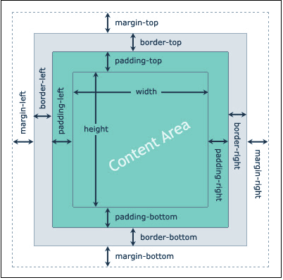

# BOX MODEL

Align text property is used for text only but not for image eg h1{text-align:"center"}.
But the above property will not work for images since image is not a text. For such type of data we use box-model. Inside box-model we use margin property to relocate image position

box model : For all the html elements in css, it will create one box. That box will consists of content, padding, margin, border

Padding : the distance between content and border

margin: the distance outside the border

border: the line around the content is known as border

<!-- img {
  /* for horizontally image increase */
  width: 200px;
  /* for vertically image increase */
  height: 200px;
  /* for image outline  */
  border: 4px solid rgb(123, 0, 255);
  /* to create a circle border  */
  border-radius: 50%;
##### padding can be given for all sides ==> TOP RIGHT BOTTOM LEFT
  /* padding : 0px 0px 0px 0px; */
#### padding can be given in pair for all sides ==> TOP_BOTTOM  RIGHT_LEFT
  /*  padding: 0px 0px */
#### padding can be given for all side at once ==> top_right_bottom_left
  /*  padding : 10px; */
#### padding can be given for specific side only ==> left_only
  /* padding-left : 10px; */
  ##### margin can be given for all sides ==> TOP RIGHT BOTTOM LEFT
  /* margin : 0px 0px 0px 0px; */
#### margin can be given in pair for all sides ==> TOP_BOTTOM  RIGHT_LEFT
  /*  margin: 0px 0px */
#### margin can be given for all side at once ==> top_right_bottom_left
  /*  margin : 10px; */
  #### margin can be given for specific side only ==> left_only
  margin-top: 20px;
  /* margin-left: 20px; */
  /* to your image some shadow effect */
  box-shadow: 10px 10px 10px red;
  /* to blur the image  */
  filter: blur(1px);
  /* to increase brightness */
  /* filter: brightness(1) */
}

/* small animation  on image  */
img:hover {
  /* filter: blur(0px); */
  transition: 7s;
  transform: rotate(2000deg);
  /* margin-top: 100%; */
  margin-left: 100%;
}

/* by default browser has some margin and padding. Hence to remove that you give set margin, padding to 0.
Instead of passing the property individually to every element. Direct use universal or global selector to make change in every element by just writing one line of code */

* {
  margin: 0px;
  padding: 0px;
}

#cs {
  border: 1px solid red;
  text-align: right;
} -->
